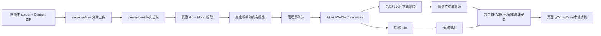

# Terraria 资源自动化交付记录

## 本轮追加：存档工具和页面体验优化（2026-10-05）

TerraWasm PR [#30](https://github.com/Live-yum/TerraWasm/pull/30) 已审核并合并，远端合并提交 `729b6f60`；本地保留原内置色表/TMRT、dirty world 与流式保存修复，最终原生提交 `225fdfc`。新 PLR/WLD 产物及其原始 manifest、来源和摘要已同步小程序，应用提交为 `001cd8a`。可探测兼容布局的未来 PLR 仅查看和原字节导出，不进入编辑或版本转换路径。

本轮改动项目为 TerraWasm、viewer-app、Tdecoder 根 gitlinks，以及本项目交付文档；viewer-boot、viewer-admin、线上数据库和 AList 本轮没有新变更，也未推送或部署应用代码。

| 用户需求 | 实现 |
| --- | --- |
| 物品标记记忆 | 偏好和样式独立持久保存；成功处理清理当前世界待处理队列，保留偏好。导入新世界再次进入标记页恢复选择；显式清空仍删除偏好。 |
| 微信版本更新 | 删除自定义确认弹窗；按用户确认，新版本准备好立即调用 applyUpdate，重复回调只执行一次。 |
| 我的“更新资源” | 改为菜单，点击后台异步安装，跨页面继续并显示验证字节进度；预检也防重复。用户仅见“更新失败”，内部审批/撤销/SHA/防重放检查不放宽。 |
| 开发商 | 首页和角色均显示国服/国际服，写入实际 xindong/relogic；编辑后的 WLD/PLR 均由原生解码回读检查。 |
| 预览和处理 | 本地预览不等审批网络；局部缓存缺族整个会话回退内置。人物懒目录仅用完整安装远端或整套内置，两个 acquisition scope 共享各自引用计数。补齐官方66坐骑布局和82去重贴图，增量105098 B。大世界任务按8 ms片段让出UI，取消仍逐4工作单位检查。 |
| 成就列表和分享 | 全部137卡片使用固定比例静态atlas裁剪，去除每卡测量桥接和懒加载；按钮始终“分享文件”。微信完整广告完成才分享，成功展示原参考路径图片和单一“知道了”按钮，取消/失败不报成功。H5 继续支持浏览器下载。 |

H5 开启公共广告配置时没有微信视频广告API，原先会阻断存档处理；仅 H5 编译分支予以适配。源码回归测试强制 ads.enabled=true，实际 MP 编译产物及 VM 执行检查确认该豁免完全剔除，微信无广告完成确认仍拒绝交付。实体物块页签的原 TnTabs uid/name 异常也已局部修复。

最终微信构建 **5,864,093 B（5.59 MiB）**，主包 **1,493,000 B（1.42 MiB）**，共享资源分包 1,726,085 B／RGB 分包 1,605,141 B。总包6 MiB、主包1.5 MiB、各分包1800 KiB预算通过。WLD WASM 324419 B，保持320 KiB门槛。

实际空闲 Edge H5 使用独立新浏览器 profile、真实选文件和子 img 解码完成计时：

| WLD输入 | 文件字节 | 信息可见 | 信息与新预览均可见 |
| --- | ---: | ---: | ---: |
| 小世界 | 3,029,192 | 293 ms | 449 ms |
| 中世界 | 7,776,673 | 364 ms | 598 ms |
| 大世界 | 11,987,858 | 501 ms | 828 ms |

H5 已暂存世界信息处理并完成界面刷新493 ms；首页同时选择世界信息、物品标记和点亮视野，最终复测小世界727 ms、大世界1595 ms（之前独立样本分别882 ms、1817 ms），真实WLD和MAP均下载成功，导出WLD重新上传后解码显示国服。大世界MAP9084794 B，WLD11987858 B；历史页面流式保存的实际输出字节数和SHA256与处理结果一致。PLR新浏览器导入后信息45 ms，导入前后画布像素确实改变且对应128×112非透明头像可见574 ms；国服保存后的3872 B实际本地PLR经原WASM解码，magicAndType=245286129420364152。

独立 Node/WASM 小/中/大世界点亮MAP+header patch+WLD提交为162.9/310.3/433.5 ms；Node不包括picker、平台写入和真实图片渲染，不能代替微信界面计时，也不构成所有手机/所有操作组合5秒保证。计时排除广告、资源网络及原生分享等待，原存档均未修改。

全量 validate 11步通过；后续角色整理一处同源显式参数修正，通过6项实际组件测试、类型检查和两端重建。最终 test:all 为1090检查中1074通过、16可选oracle/私有夹具跳过，0失败，退出码0。Native PLR54项/WLD135项通过，另38 legacy检查通过。Astra只读复核关闭两处局部缓存缺口并确认未来PLR字节安全。静态quality-delta仍报告复杂度/churn信号，未冒充全绿。

实际H5首轮12场景通过：真实三种WLD、首页编辑处理、标记偏好、像素画绘制/写入/PNG下载、PLR预览/编辑/保存、137成就快速滚动/导入/分享和资源失败文案；另15路由仅验证导航与可见内容。专项验证实际物块页签列表切换、同一页面连续替换三种世界的名称/尺寸、三项同选输出回导和PLR国服写入。宝箱改名与向导图鉴解锁合并处理后，导出回读两项均保留；克隆69条净化规则并修改限额后处理1108 ms，真实WLD回导成功。关闭服务器和浏览器再完全断网冷启动：首页、像素画、137成就快速滚动、真实PLR及坐骑8预览仍可用。真实本地48080后端approval-state HTTP200，My“更新中/正在准备更新”进度并离页成功；active=null未发生完整线上安装。

微信首屏和快速滚动已有实际截图，后续主进程无响应/CLI连接授权超时，剩余微信文件处理点击和广告后系统分享验收待恢复工具。已请用户保存并重启工具、允许Codex连接；未终止用户工具或清除其项目缓存。激励广告和系统分享的原生mock不等于真机完成广告或文件送达。世界生成云端提交、云存档上传、装备组合图云端上传、需要登录的写操作和实体手机合法域名未在本轮H5验证，不将导航通过写成全部功能验收完成。

私有原始测量、下载副本、截图和可复用QA驱动在 `.runtime/optimization-h5-20261005/`、`.runtime/optimization-wechat-20261005/`、`.runtime/native-pr30-20261005/`，不进入Git。本轮H5壳 `fceef59d73264ae0d2e8146b` 固定后才跑验收。生产审批仍active=null，故不能把线上完整资源安装标为本轮已成功。

## 上一阶段：本地混合资源与数据库审批（2026-10-05）

本节为上一阶段记录；包体和测试数量以本轮追加为准。后面的 2026-10-03 记录也保留作历史证据。

用户选定本地提取器、后端选择性整合、本地管理端和小程序。保留云存档、装备组合图上传及成就功能；历史内置功能恢复为共享资源，已验证线上资源优先使用。此次源码只本地提交，没有推送或部署生产应用。

| 项目 | 本次改动 |
| --- | --- |
| terraria-resource-pipeline | 强制复验 25 个必需元数据族、引用和真实计数；完整校验贯穿快照/审核/发布准备。RGB 临时排序使用任务私有磁盘，避免 32 MiB 系统 tmpfs 满；Linux 镜像构建使用最小上下文。 |
| viewer-boot | 数据库审批状态、CAS/租约/发布日志、审计及永久撤销；审批绑定四个摘要、任务版本、频道序号和请求身份。匿名下载仅服务未撤销的已批准清单，微信获取直链、H5 获取代理正文。旧 AList 基线通过私有短期快照读取和完整校验，不因此开放匿名下载。保留云存档与装备接口。 |
| viewer-admin | 接入审批状态、并发保护、审核确认、审计分页、撤销与安全恢复；过期审核必须刷新，未知 AList 发布任务保留原日志。 |
| viewer-app | 历史内置资源共享去重、按需远程资源、完整离线安装和 H5 离线壳；持久双槽序号/撤销记录、防重放和按来源隔离缓存。公共资源清理与账号私有缓存分开。首页“高级功能”新增“成就编辑”，旧分类缓存和首次断网也有入口。 |
| TerraWasm | 可安全选择编译内置色表，保留已打开世界和未保存修改，同时废弃旧色表相关媒体与预计算结果；干净 WASM 同步到应用，来源提交 `8510f68`。 |
| terraviewer-images | 保持恢复后的线上原版，工作树干净，本次未修改。 |

### 已完成的真实数据库修改

按用户明确授权，使用本地配置连接线上 MySQL `viewer_pro`，先备份再迁移：新增六张资源持久化表、资源后台权限菜单。原云存档、装备和用户文件表没有修改。备份为私有 `.runtime/hybrid-db-20261004/before.sql`，619,694 B，SHA256 `ed6b0dace5015cf9e4887444e8e3a88337bac9da5bb407d65151b6b760e1b194`。

后续按用户要求，在 tenant 1 的“高级功能”（category 16）新增菜单 260：显示名“成就编辑”、排序 6、路由 `/features/achievements/pages/editor`，图标 `/static/imgs/achievement-timber.png`。图标从官方 TIMBER／木材！！成就完成帧精确裁出，64×64，2,407 B。菜单修改前备份为同目录 `achievement-menu-before.json`，SHA256 `6e2c15d5c06fd663d06437a33d95f0d3d6b27c9bf3608fbcdc39be85a4b6b0b3`。线上及本地 API 均读回同一记录；可重复执行的迁移保存在 viewer-boot 的 `sql/mysql/viewer_achievement_editor_menu.sql`。

本地后端以 Java 17 连接真实数据库/Redis，监听 `127.0.0.1:48080`，关闭自动提取调度和 Quartz，用于前端只读验收。生产资源审批状态已生成持久 authorityId，序号为 `0`、active 为 `null`。本次没有批准或发布新的生产资源版本；原 AList 对象和 stable 未覆盖。部署新后端后，首次正式资源仍需由管理员审核并批准；测试 H2 的已发布记录不能当作生产审批凭据。

### 输入、资源体积和内存

真实精简输入包为同版本官方 `server/Linux/` 完整发行目录与 Steam `Content/Images/` 全目录，ZIP 52,611,057 B／15,154 文件，展开 89,825,350 B。只提供 exe 和部分 Images 不构成此验证输入。输入 SHA256 为 `53017b4eab1b1ef0119716164578e6b139359f7343bff0ff01bb8ad3a5b7c2e6`。

断网、只读、非 root、无凭据 Linux 容器实际提取为 READY，缺失项 0；后端真实分片上传→提取→完整差异审核通过。输出与原全输入相同，manifest SHA256 为 `042f843054abf79b47aa7b85375c058887ea8a90adab4018742e819adde27ab0`：6,195 个物品、13,203 个逻辑纹理／12,669 个唯一 PNG，25 个必需元数据族。完整资源下载仍为 18,542,799 B。

恢复共享内置功能后的当前小程序总包为 **5,669,175 B（5.41 MiB）**，主包 **1,454,644 B（1.39 MiB）**。总包 6 MiB、主包 1.5 MiB、各分包 1,800 KiB 预算均通过；共享纹理/目录分包 1,610,882 B，RGB 分包 1,605,141 B。历史的 2.06 MB 总包对应未恢复内置范围的版本。

独立提取 Go+Mono 的实际采样 RSS 峰值 **258,072,576 B**，内核 cgroup 峰值 299,008,000 B（包括被计费文件缓存，未发生 OOM）。同一时间轴采样的完整后端联动峰值 **464,072,704 B**，包含 Java、Go、Mono 和 Docker CLI；其中 Java+Go+Mono 合计 **437,727,232 B**。因此独立提取达到约 300 MB 目标，**整个后端流程仍未达到**。没有把各进程不同时间的峰值相加，也没有将无法读取的合计 cgroup 指标写成零。

此次全部阶段的 Java+Go+Mono+Docker CLI 峰值记录如下，原始 4,744 条采样和报告保存在私有 `.runtime/hybrid-combined-memory-20261004/`。

| 阶段 | 同一扫描合计 RSS（B） |
| --- | ---: |
| 启动/上传 | 197,484,544 |
| unpack | 215,179,264 |
| identify-input | 190,226,432 |
| textures | 239,218,688 |
| game-metadata | 464,072,704 |
| texture-scope | 258,101,248 |
| texture-packs | 258,101,248 |
| metadata-packs | 295,366,656 |
| rgb-candidates | 262,881,280 |
| rgb-srgb | 370,667,520 |
| rgb-txci | 370,585,600 |
| verify | 251,473,920 |
| 提取后审核 | 259,063,808 |

采样间隔中位数 50 ms、p99 50.453 ms、最大 56.969 ms，顺序扫描最长 39.042 ms；短暂峰值可能漏采，共享页也可能重复计数。不包括数据库、Redis、Docker 服务及整台主机其他进程。

实际旧 AList 基线只读全量校验亦通过：728 个对象、18,331,762 B、变化 0、stable 摘要不变，未写 AList 或生产资源任务。该顺序快照耗时约 28 分钟，Go 堆峰值 18,809,392 B；不能用本地快照时间代替真实百度存储延迟。

### 验证与当前限制

- app `npm run validate` 11/11 门槛通过；1,061 项测试中 1,045 通过、16 个可选跳过、0 失败，H5/微信构建及包体通过。
- 实际 H5 冷启动、人物/137 项成就/像素画、真实世界内置色表预览通过。完整离线壳安装后关闭浏览器和测试服务器，再阻断网络重开；无分类缓存也可从首页图标进入成就编辑。真实后端审批状态 seq 0 测试没有伪造已批准资源。证据在 app 私有 `reports/hybrid-h5-acceptance/`。
- 当前微信开发者工具隔离测试项目实际显示内置人物、首页高级菜单及木材图标；不清除用户原项目缓存。重复 ES6 编译导致的图片预热错误已复现，并设置生成产物关闭开发者工具的重复 ES6/增强编译，Vite 负责转译。此次没有实体手机验收。
- Go 全仓 test/vet、Java 17 clean package 与资源持久并发/HTTP/恢复/私有基线 smoke、管理端 24 项聚焦 Vitest 和生产构建通过。管理端全局类型检查仍有 1,144 条既有诊断，修改范围没有新增诊断。
- native 12 个合同与应用真实 WASM 的 32 个聚焦检查通过，覆盖 dirty world、buffer/source 两类世界、色表切换和撤销后的延迟预览结果。
- 静态 quality-delta 仍标记资源状态机复杂度及历史 churn，不宣称静态质量门槛全绿。特殊 GPU 效果继续明确近似，存档格式或绘制算法升级仍需要代码适配。

---

## 历史交付记录（2026-10-03）

2026-10-03 地图预览补充修复：之前基础离线打开世界后首次按需加载 TMRT 色表被 native 的 world-count guard 拒绝。现在首次安装可在世界已打开且无活动任务时完成，已有色表替换/清理的保护仍保留。前端网络读取不占世界队列，native 安装串行化；reset 在关闭世界后清理色表，等待资源期间切换/重命名世界会取消旧保存操作。未关闭并重开编辑中的世界，未保存修改由真实 WASM 回归验证保留。

新 native 干净产物提交为 `4539a8407be29efed9a755e81c49cf5ec10a67e4`，WLD-only、`-Os`、LTO、ABI 导出不变；只本地提交，没有推送。当前 app 验证 11/11，总测试 1002（987 通过、15 可选跳过、0 失败），H5/微信构建及包体门槛通过。真实微信开发者工具 3.17.2 中，对刚报错的同一份 11957052 B 存档先离线打开，再加载已安装资源，生成 960×274/708601 B PNG；网络请求 0，世界句柄、代次和完整 header 不变。首次冷资源加载、校验、预览合计 57.541 秒，重复预览 1.387 秒；首次耗时仍待优化，尚未分阶段归因。实体手机尚未验证。

本次只改 TerraWasm、viewer-app 和交付/计划文档；其它项目及 AList 资源未重新发布。用户的 native 外部修改保留。两个临时 native 测试目录的清理被自动审批 `blocked by policy` 拒绝，已留存。

六项目提取及离线接入已有本地真实验收；2026-10-03 按用户要求改为 AList /WeChat/resources。后端上传，微信直接下载后端返回的链接，H5按用户确认经后端下载；16:05真实728个公共对象、release和正式stable发布完成，journal=complete、任务DB=published，发布前后全部引用SHA以及独立release/stable读回均通过。最终资源版本为 1.4.5.8，manifest SHA256 `042f843054abf79b47aa7b85375c058887ea8a90adab4018742e819adde27ab0`。真实AList的H5完整安装、最新页面壳冷离线复验、微信原生整包安装及重启后阻断请求的完整数据/人物/画布读取均已通过。首次未安装时的WLD/PLR基础操作及页面进入另作验收，资源依赖区域可以按需加载和重试。应用代码未部署到生产服务器，实体手机整包断网验收未执行。

## 修改的六个项目

| 项目 | 改动 |
| --- | --- |
| terraria-resource-pipeline | 原 Python 原型替换为 Go 标准库 CLI；流式安全解包、XNB/LZX/DXT、无损 PNG、真实 Mono 游戏逻辑、25 个元数据族、RGB/SRGB/TXCI、SHA 去重分片、差异审核与确认发布、逐阶段内存报告、Docker 非 root 隔离。 |
| viewer-boot | 独立资源任务/API/SQL/权限；4 MiB 顺序分片与断点续传，后台提取、审核明细游标、绑定审核/候选/基线频道/基线清单的明确发布、取消/重试/重启恢复；AList 凭据只留后端，匿名download-link只返回可信HTTPS链接元数据，不读取文件正文。 |
| viewer-admin | 资源流水线页面/API；上传与续传、进度、逐域变化和详细差异、各阶段内存与耗时、确认发布；取消/重试及过期审核保护。 |
| terraviewer-images | 已恢复线上原版 main `7adc973`，工作树干净。新资源另存私有备份与提取目录，此仓库不再参与新发布流程。 |
| viewer-app | 游戏目录/纹理/RGB统一共享版本资源会话；“我的→更新资源”完整安装、校验、暂停/重试、失败保留旧版、普通清缓存保护、版本租约；移除旧资源分包消费，人物原图本地组合、染料与特殊效果近似提示；H5 离线壳与微信六个代码分包预载。 |
| TerraWasm | 增加外部 TMRT 色表/TXCI 接入，修复 306/307 颜色组完整性及天空/地层/前景油漆；干净构建产物和来源 SHA 同步到 app，保留已有流式性能与文件生命周期修复。 |

## 体积

以下 MB 为十进制，所有字节均另列。全量离线集比原小程序局部资源覆盖更广，不能直接用原部分资源下载量作同口径对比。

| 内容 | 字节 | MB |
| --- | ---: | ---: |
| 初版公共对象下载 | 72,525,981 | 72.53 |
| 最终公共对象下载 | 18,331,762 | 18.33 |
| 最终 SDK 完整资源下载（包含清单/通道，不含链接响应） | 18,542,799 | 18.54 |
| 完整持久安装（包含清单/状态） | 18,327,005 | 18.33 |
| 无损唯一 PNG 本体 | 11,723,318 | 11.72 |
| 原 app 总包（用户基线994a50d） | 4,865,762 | 4.87 |
| 最新 app 总包 | 2,059,326 | 2.06 |
| 最终 app 主包 | 1,364,765 | 1.36 |

公共对象较初版减少约74.7%，app总包减少约57.8%。13,203 张逻辑纹理对应12,669个唯一PNG，256个gzip ZIP图像包；没有重复裸图。资源还覆盖6,195物品完整默认属性/说明、400Buff、97前缀、546图鉴、30油漆、全部人物/装备源绑定和66坐骑。原始整包668,310,970B不公开。

## 内存和耗时

| 实际运行 | 峰值字节 / 时间 |
| --- | --- |
| 独立全量提取，Go+Mono及子孙RSS | 264,871,936B；238,717ms |
| viewer-boot最终AList协议重复调用，Go+Mono及子孙RSS | 250,716,160B；上传至审核264,413ms，上传4,085ms |
| 提取容器charged cgroup（含文件缓存） | 299,003,904B，无OOM；设置299,000,000B/no-swap |
| JVM自身RSS，单列 | 219,009,024B（最终Linux本地全流程） |
| 宿主审核Go RSS | 27,049,984B |
| AList Go完整校验/首次审核/计划/快照/无变化审核RSS（最终缓存优化） | 46,972,928B；76.27s；cgroup128,413,696B |
| 实际AList发布前Linux空基线快照RSS | 7,208,960B；1,759ms；cgroup10,285,056B |
| 实际AList旧串行发布JVM PeakWorkingSet，Windows | 279,281,664B；objects阶段停止用于安全恢复优化版本 |
| 实际AList最终恢复发布JVM PeakWorkingSet，Windows | 246,157,312B；恢复段4,195,218ms，不是从首次上传起的总时长 |
| 实际AList最终恢复发布同采样进程树峰值，Windows | 253,870,080B；含子conhost，不含独立下载测试服务 |
| 历史本地bare完整审核/确认/Git发布RSS（现已停用） | 44,396,544B；37.23s |

隔离提取任务低于300,000,000B目标；包含Java后端的合计目标尚未达到。2026-10-03另用相同668,310,970B游戏包完成一次Linux真实上传、提取与审核，260.1s，通过且不发布AList。同一扫描周期Java+Go+Mono RSS最高为437,727,232B，发生于game-metadata：Java192,425,984B、Go13,991,936B、Mono231,309,312B。此轮提取进程树自身峰值245,039,104B、提取cgroup峰值299,003,904B且无OOM；Java独立峰值216,018,944B出现在其它时点，不把独立峰值相加冒充同时峰值。

该轮全部阶段的合计采样RSS如下，原始6766条采样与报告位于私有`.runtime/boot-combined-memory-20261003/{samples.jsonl,combined-memory-report.json,verification.json}`。

| 阶段 | Java+Go+Mono采样峰值RSS（B） |
| --- | ---: |
| Java启动/上传 | 191,627,264 |
| unpack | 167,944,192 |
| identify-input | 163,819,520 |
| textures | 218,767,360 |
| game-metadata | 437,727,232 |
| texture-scope | 233,226,240 |
| texture-packs | 224,342,016 |
| metadata-packs | 266,592,256 |
| rgb-candidates | 231,841,792 |
| rgb-srgb | 345,726,976 |
| rgb-txci | 346,042,368 |
| verify | 221,065,216 |
| 提取后的审核 | 236,531,712 |

采样间隔中位数50ms、最大55.299ms，单次顺序扫描最长27.676ms，并非原子快照，短暂峰值仍可能漏采；各阶段边界按提取器报告时间对齐。RSS求和可能重复计算共享页。峰值时Java/提取容器cgroup memory.current分别为937,992,192B/298,950,656B，包含文件缓存，不能与RSS混为一谈。这是隔离测试服务与提取进程的合计，不包括数据库、Redis和其它服务器服务，不代表整台服务器内存。历史各进程独立峰值之和469,725,184B仅为保守上界，现有同一扫描证据应优先引用437,727,232B。其它逐阶段RSS/Go堆/cgroup/耗时见[真实验收](REAL-VERIFICATION.zh-CN.md)。

额外只读诊断发现，Mono存活的2682次采样中2658次（99.1%）合计已超过300MB；没有Mono的RGB阶段也达346MB。Java已使用-Xmx128m，CLR在人物绘制/贴图引用闭包前已有显式GC。目前没有实测证据支持通过一个堆/GC参数实现全流程300MB；缩短CLR临时数据生命周期仍只是未实测的优化方向，不能据此声称目标已达到。私有分析见同目录`memory-feasibility.md`，未为此修改生产配置或重跑正式发布。

## 检查

- Go全仓tests/vet、全部SHA/ZIP CRC/PNG尺寸/公开路径检查、独立与真实后端同摘要重复提取通过。
- boot实际Linux非root调用、Tomcat权限/租户/分片重试/审核摘要竞态通过；完整本地bare发布通过，未调用生产GitHub。当前全部源码隔离副本使用Java17/Maven3.9.11执行标准 `-nsu -pl yudao-server -am package -DskipTests`，20/20 reactor通过、142.1s，生成167,427,908B服务JAR；此前记录的websocket编译问题本次未复现。原target和正在运行的真实AList服务未触碰。
- admin实际浏览器上传中断/刷新续传、差异与内存展示、延迟关闭确认保护通过；最终AList协议Vitest6/6和build11/11通过。admin全仓vue-tsc有1,144条既有诊断，新页面/API没有新增诊断。
- TerraWasm原生15/15、Node82/82；真实11.9MB世界WLD无修改保存字节不变，流式与整文件MAP SHA一致；实际启用最终Web+官方TMRT的事务/冷重开测试通过。
- app最终平台分支validate11/11；全量tests996项中981通过/15可选跳过/0失败；额外启用私有人物DrawData及全装备帧界限检查35/35，无跳过。标准构建不包含测试游戏夹具。MP610文件、6子包，主包508文件/1,364,765B，总2,059,326B，包体预算通过。
- 早期本地资源树H5验收：“我的→更新资源”完整下载18,542,798B/730请求后关闭浏览器，断网重启读取25族467分片121,980行及13,203纹理目录；普通缓存清理后完整安装仍有效。7个基础路由加2个真实世界依赖页面通过，物品详情109属性、真实WLD地图960×274、PLR“烟花”非空人物与近似提示均正常，pageErrors为空。此项使用本地树，正式AList的18,542,799B及最新构建证据另列下文。
- 320/390/768px三宽度实际DOM向上、向下遍历全部228发型、6,195物品、6,138研究、400Buff，24/24通过，最多108个渲染节点。最终人物画布修复后重新完整安装/断网/全部页面，并再次关闭重开核对128×112画布和截图；没有把修复前的截图算作最终视觉验收。
- 静态quality-delta并非全绿：资源状态机和游戏绘制适配的复杂度增加、以及历史短期变动被标记；未将它冒充通过的质量检查。

## 部署和发布

1. 按 viewer-boot 的 [部署说明](C:/Users/depths/Desktop/Tdecoder/viewer-boot/docs/resource-pipeline.md) 准备 Linux amd64 Docker、固定 CLI、SQL 迁移和菜单权限、UID10001 持久目录。配置既有 AList 连接、资源根 `/WeChat/resources`、后台快照/file来源和精确可信下载主机；不需要 Git checkout 或 Git 凭据。最终本地默认镜像已指向缓存优化构建`sha256:3e219510fe1744b78a19d030af162d74db6c210d40c9eb39e85bf0750e1e2a5a`。
2. 构建部署后端、admin 与 app。微信匿名下载链接入口为当前API域名的 `/admin-api/viewer/resources/download-link?path=...`，响应 `{code:0,data:{url}}`；微信直接下载该签名HTTPS文件。AList token与密码不进入小程序，临时链接不持久保存为资源身份。微信需配置API域名和实测下载主机`bjbgp01.baidupcs.com`的合法域名；存储节点变化时需先验证并精确添加。H5按用户确认固定请求`/admin-api/viewer/resources/file?path=...`，资源正文占用后端带宽。私有云存档仍保留原鉴权。
3. 上传完整同版本 server+Content ZIP，等待自动提取和 schema 2 审核；查看全量差异和逐阶段内存，再明确确认该审核。后台上传 immutable objects 和 release，最后切换频道；未知上传任务需恢复处理，不能以新审批绕过。旧 Git schema 1 审批必须重新审核。
4. 小程序页面按需加载所需分片，“我的→更新资源”可完整下载并原子激活；失败或取消保留已有版本。缓存的分片和完整离线集在重启后恢复。在线账号、云存档和分享仍需网络。

资源更新能自动覆盖新增ID/名称/属性/纹理，但存档格式或游戏绘制算法改变仍需更新程序。中文Tile/Wall说明仅展示游戏本身可导出的信息；没有游戏来源的Wiki/TEdit补充已去除。特殊GPU染料、光效、粒子和动态坐骑明确标注近似。微信离线文件系统与分包协议已用fake WxFS、构建检查及实际开发者工具原生完整安装/重启后阻断请求验证，尚未拿实体手机作此次整包断网验收。

旧资源及原生构建二进制删除曾被自动审批拒绝，工具没有提供具体理由；保留原文件，并通过构建禁入检查确保旧资源不打包。私有上传、程序集、DrawData对照、内存报告与AList凭据不公开。

## 2026-10-03 弱网和 AList 下载地址复验

- 原生 WeChat 缺失 `active.json` 的 `not found` 已在共享存储层正确识别；不存在完整安装时不阻止本地 WLD/PLR 基础操作与页面进入。
- 已检查的 partial manifest 独立存为 `cached.json`，不假称完整 active；动作按需准备 map/pixel/player 家族，失败在对应区域显示并可重试。
- 新 app validate 11/11：989 项中 974 PASS、15 可选 SKIP、0 FAIL；H5 shell 118 文件/2,527,362B，指纹 `058e4dbfc03003893e569782`。admin build 11/11 PASS；全仓 TS 仍有既有错误，资源页无相关诊断。
- 新后端代理地址的实际 H5 夹具验收：fresh 阻断资源时真实 WLD 元数据、像素绘画/写入预览、PLR 创建/编辑/导入均可用；partial 仅 3 请求/217,581B，关闭重启并断网后仍可读已缓存 256 行，active 为空。
- 完整离线安装 730 请求/18,542,799B，关闭浏览器后冷离线恢复同一 active release，两组 pageErrors 为 0。所有请求由只读本地资源树拦截，此证据不代表生产 AList 已部署。
- 图片仓库恢复前新树有 backup ref `refs/codex/backups/pre-alist-20261003`，本地目录 `.runtime/cdn-before-alist-20261003`；没有推送 GitHub 或覆盖线上频道。
## AList审核效率与内存复验

实际相同1.4.5.8候选的Windows CPU profile确认跨分片/乱序ID反复重读；审核内部增加每侧最多16MiB解码缓存，超过大小继续流式读取，所有明细顺序、字节和SHA合同不变。聚焦WriteReview同环境13.59s→6.50s；最新Linux完整协议验收76.27s/RSS46,972,928B，阶段为校验12,452ms、首审21,430ms、准备发布21,856ms、基线快照4,860ms、无变化审核15,602ms。之前完整Linux329.62s作为同候选历史观察；运行并发与调度不同，不将全部差值归因于缓存。日志 .runtime/reports/alist-go-real-optimized.log 与 .runtime/alist-go-optimized-memory/memory.json 为私有验收证据。Go全仓tests/vet及乱序/跨pack/大小回退/源篡改/完整明细SHA回归通过。

最终viewer-boot Linux amd64非root调用Go/Mono：668,310,970B上传→完整提取→schema2首发审核与完整明细分页PASS（.runtime/reports/alist-boot-final-verification.json）。manifest仍为042f8430，review SHA为de4e6408；优化前后135,187条NDJSON明细共52,333,934B，detail SHA同为d051880e。提取RSS250,716,160B、容器cgroup299,003,904B，JVM累计RSS219,009,024B另列；完整264,413ms。snapshot/extractVerify/reviewVerify/review均有私有内存JSON；宿主Go报告的cgroup包含JVM及上传ZIP文件缓存，不能当成提取容器内存。该验收以首发404下载夹具供基线，不写正式AList。

## 真实下载验证记录

2026-10-03 正式AList资源的H5完整安装通过：实际“我的→更新资源”发出730个唯一请求，共18,542,799B，729个带摘要路径逐一匹配SHA；所有正文由真实Java `/file` 从AList读取，没有使用本地候选树替代。安装耗时1,407,536ms，pageErrors/routeErrors/前端Baidu直链请求均为0。关闭整个浏览器后，在重新导航前启用断网，恢复同一042f8430版本，读取25族467分片121,980行、13,203纹理目录和tile首片256行；真实PLR导入、非空128×112人物预览、本地生命编辑120和像素画板通过。私有报告`.runtime/reports/full-resource-real-alist-h5-1791013564893/result.json`。该730请求证据对应当时页面壳d8e92a43，不能冒充后续构建的网络下载证据。

之后的微信跨realm字节修复使H5页面壳变为`5d029738135fa9ac2ec683c5`（118文件/2,528,265B）。新版用相同origin及上述真实持久安装，实际再次点击“我的→更新资源”并确认复核同版本文件，进度完成728/728。仅1个真实Java→AList请求读取86B stable，其余对象从已验明的持久缓存全量校验。确认active/controller/cache/meta均为新指纹；再次关闭整个浏览器，先断网再导航，全部25族/467分片/121,980行/13,203目录、既有真实人物预览与本地编辑、像素绘画通过，pageErrors/routeErrors均为0。不声称该轮重新下载730次。最终私有报告`.runtime/reports/full-resource-new-shell-cached-h5-1791016281176/result.json`；此前纯缓存冷重启报告1791015961003也保留。测试更新窗口先前被过早关闭，旧worker尚未完成激活；等待installed并让同源页离开后正常切换，未为此改动产品逻辑。

正式AList的按需加载另以空profile复验：仅下载stable、manifest及tiles首片3个路径，共217,581B；关闭后重开并断网仍读取256行、active保持为空，没有把部分缓存当完整安装。阻断资源时，实际WLD元数据、PLR基础编辑、像素画布及写入页面仍可进入；需要材料映射和装备纹理的区域显示重试。私有报告`.runtime/reports/fresh-partial-real-alist-h5-1791013518219/result.json`。

微信原生验收发现实际`wx.getFileSystemManager().readFileSync`返回的ArrayBuffer属于另一运行环境，`instanceof ArrayBuffer`为false，导致已经下载的manifest被误判为非字节。已改用ArrayBuffer内建byteLength getter验证真实品牌并创建视图，继续拒绝伪造toStringTag/原型对象。Node vm跨realm及fake WxFS完整安装/重启恢复回归通过；微信清除仅编译缓存后实际模块源码、原生84B及210,951B缓冲转换均通过，没有清除用户存档或资源缓存。该阶段tests为994项/979PASS/15可选SKIP/0FAIL；后续批量验证修复后最终996项/981PASS/15可选SKIP，validate11/11及包体统计均已通过。

新download-link已通过Java17编译及嵌入Tomcat匿名HTTP测试：公共路径返回链接，私有路径404，断言不调用store.read，凭据不出现在响应。真实连接现有AList并对已上传公共对象取得链接成功，返回主机为`bjbgp01.baidupcs.com`。

Edge默认UA在localhost与`https://www.terrariav.xyz`origin真实fetch同一1,196,021B TXCI对象均被CORS拦截；没有取得可读响应或资源正文。正式站点导航本身为502，因此这只是该origin直链限制证据，不是线上应用验收。私有证据为`.runtime/reports/real-alist-cors-1790998584286/result.json`及`real-alist-production-origin-cors-1790998721585/result.json`，未记录签名链接或凭据。没有用route.fetch/fulfill伪装直链成功；用户已明确授权H5使用后端字节下载，微信保留直链。

实际微信开发者工具中使用原生wx.request：先访问真实Java download-link，再默认UA直接取Baidu 1,196,021B TXCI，HTTP200/gzip magic/SHA `0004999774e585913bfe3108553c09faa60a28c6d5ff3b9cde3fe220f0ee8991`全部通过，耗时2,176ms。证据`.runtime/reports/real-wx-direct-test-domain.log`。仅测试localhost服务期间临时关闭生成产物域名校验，已字节精确恢复原project.config和urlCheck=true并refresh；未改源码配置，不将此证据冒充实体机或线上合法域名验收。

该阶段平台分支validate 11/11通过；当时H5 shell指纹`d8e92a43c2dd0d82635f4687`、118文件/2,528,196B。实际Edge从H5页面调用transport，API地址只改写至真实Java/file，Java实际读取AList对象并返回1,196,021B，SHA及gzip一致、无Content-Encoding、没有前端Baidu raw请求。私有证据`.runtime/reports/real-alist-h5-file-1791000010622/result.json`及h5.png；没有读取本地候选文件来替代远端对象。后续正式频道及完整安装结果见下文。

最终MP逐文件计数610文件、总2,059,022B、主包1,364,461B；包体预算检查通过，证据`.runtime/reports/hybrid-final-mp-size.json`和`hybrid-final-mp-size.log`。此次原生测试之后已恢复生成配置，再统计，未将临时urlCheck关闭的产物交付。

最终H5独立空profile屏蔽资源请求，真实WLD元数据、像素画板和写入区域、PLR新建/导入/本地字段编辑仍可进入；没有伪造active完整安装。证据`.runtime/reports/fresh-partial-real-alist-h5-1791000050153/result.json`。资源依赖的地图/材料/装备预览显示失败与重试，不能将基础页面可用写成未安装也能离线完整功能。

实际Linux Go snapshot经真实Java/AList读取尚未发布的频道得到经验证的404，写完整空基线身份`absent`，RSS7,208,960B、耗时1,759ms；证据`.runtime/alist-prepublish-snapshot-20261003/memory.json`和`snapshot/.snapshot.json`，不是模拟404。

实际AList网络采样发现重复祖先目录刷新占主要时间，改为直接父目录完整分页证明优先、不可列举则祖先fallback，并对已证实存在的目录作正向缓存；没有缓存“不存在”、跳过SHA、改变频道顺序或增加上传并发。旧publisher仅在objects阶段、task为空、频道仍404时停止；等待同步PUT五分钟上界后，12:06:38 CST以同一H2/job/原审批/journal恢复优化版本。旧JVM PeakWorkingSet279,281,664B单列，迁移证据`.runtime/reports/alist-publisher-migration.json`。最终16:05正式发布完成，新进程峰值和恢复段耗时见上方内存表。

新增可跨平台的ResourcePipelineRecoverySmoke已实跑PASS：H2实际work调度验证旧unknown/channel_inflight不会阻止独立extract/review，仍阻止新发布；受控executor及activePublisher边界验证未终止保留FileLock、第二worker不调度、关闭后不续写、确实退出才释放；fake AList API验证done2成功/4取消失败/7失败，undone及缺失保持unknown。锁检查不等同完整AList HTTP集成。已接入标准check脚本，私有证据`.runtime/recovery-test-6473146738206809146`。

微信IDE原生资源状态检查确认active/cached文件均不存在，未清除其它本地用户状态；实际切换像素画及角色tab成功。像素画保留已有本地画布且无error匹配；角色本地字段可见，资源预览因当前线上接口尚未部署显示失败和重试。截图`.runtime/reports/real-wx-fresh-pixel.png`及`real-wx-fresh-player.png`；文件名中的fresh仅指资源安装状态为空，不是新用户profile，不代表已安装后的完整离线验收。生成配置保持urlCheck=true。

12:28优化publisher在第301个对象首次使用bucket64时失败：mkdir业务200后即时列表没有确认目录存在；当时完整响应未留存，无法把原因确定为可见延迟。后续认证完整list HTTP200/业务200/total96/scanned96已确认目录64存在，并读到第300个对象。增加mkdir成功后最多6次只读完整分页复核、间隔1s，仅明确看见目录才继续，持续未知仍失败；陈旧列表两次后成功的回归及标准三Smoke通过。12:35以同H2/job/审批/journal重试，频道仍未写；失败进程Windows PeakWorkingSet220,123,136B另列，重试峰值待最终结果。

后续补齐跨重试边界：mkdir返回业务500或IOException后仍做有界只读确认，明确存在才能继续，六轮无证据则失败并保留原异常；回归覆盖“服务端实际创建但返回500+两次陈旧列表”。标准三Smoke通过、只读复核关闭P2。跨发布重试仍可能再次发送幂等mkdir，不将其描述为请求只发一次。当前实跑进程不为该未来重试修复再次中断。

15:40微信模拟器refresh后实际点击“我的→更新资源”，download-link仅改写到真实Java40473，此时正式频道确实未发布并返回404；无raw/字节代理请求，active为空、资源对象/图片/清单文件均为0，页面继续显示“尚未安装”且更新按钮可再次点击。私有证据`real-wx-channel-absent.log/png`；没有伪造完整安装。wx.request、showModal确认mock和生成配置均已恢复，原配置SHA F7EF9BA714D49E480066AD1C1F8A81F4855C6F9FABF4745248ED5AFB02F4EFB2、urlCheck=true并refresh。正式全量验收继续等待频道实际切换。

## 最终微信完整安装与离线复验（2026-10-03）

实际微信“我的→更新资源”经真实Java的download-link取得Baidu链接，原生下载至728/728，页面明确显示已安装042f8430。采样到725对象时raw为726次/18,247,921B、proxy=0且failures为空；最后3对象及首次完整校验期间automator多次超时，未取得最终请求计数，不补造729或730次网络记录。实际完成截图为私有`real-wx-final-verification-busy.png`，其中版本、已安装文案和完整进度均可见。此次清单来自同一profile之前已经下载并检验的210,951B文件，不将总资源大小当成本轮新增网络字节。

原生文件系统是同步读，旧验证循环连续执行一万多次微任务，存在长时间占用页面线程的问题。采用已有工程模式，每32项让出macrotask，覆盖安装对象/图片、图片包已有内容检查、完整验证与冷恢复；继续全部SHA/PNG/ZIP校验，安装在批次之后检查取消。33个不同合法PNG和33个分片的回归验证定时器可在激活前运行、取消保留旧active及冷恢复调度。修复后只清编译缓存，保留原数据，再构建和重启；实际自动化读取已恢复。此前超时还可能包含连接状态因素，不把源码判断当作唯一已证实的运行归因。

最终构建重启后，旧QA全局已消失，原生文件系统仍有472个对象、12,669张PNG、1份manifest，active指向同一批准版本。随后阻断所有wx.request，实际资源SDK完成25族467分片121,980行、13,203纹理目录、全部4个RGB载荷，并解析物品/方块/墙/人物/坐骑的持久PNG；总40318ms，offlineCalls=[]。这是完整复验任务的耗时，不是单页启动或人物渲染耗时。SDK阶段没有使用网络；阻断发生在模拟器重启之后，不冒称原生环境在进程启动前已断网。H5另有关闭整个浏览器、先断网再导航的冷启动证据。

实际离线页截图包括非空“新玩家”人物预览、本地原有200×200像素画布、可见基础首页及My已安装文案；没有覆盖用户存档/绘画。本次未在微信重新导入WLD，真实WLD/PLR导入与本地编辑由H5实测和共享代码回归验证。私有证据为`.runtime/reports/real-wx-final-cold-local-summary.log`、`real-wx-final-cold-offline-sdk.log`、`real-wx-final-cold-offline-summary.log`及4份`real-wx-final-cold-offline-*.png`。

验收后wx.request原函数已恢复并refresh，生成配置SHA精确恢复`F7EF9BA714D49E480066AD1C1F8A81F4855C6F9FABF4745248ED5AFB02F4EFB2`、urlCheck=true；源码配置未为测试关闭域名校验。

加入分批验证后，最新H5壳为`0664010795a639c1ad7a36c4`，118文件/2,528,521B。再次实际点击My更新并确认同版复核，728/728通过，仅读取真实Java/AList stable86B；完整关闭浏览器、先断网再导航，全25族/人物/画布均通过且pageErrors/routeErrors为0。最终私有报告`full-resource-new-shell-cached-h5-1791017367082/result.json`；此前730路径的真实网络下载报告仍引用旧壳，不把缓存复核冒充重新下载。

最终收尾validate11/11及check:size通过，最终MP610文件/6子包，主包508文件1,364,765B、总2,059,326B；最新H5构建指纹仍为0664010795a639c1ad7a36c4，与最终真实缓存复核报告一致。自有Java下载测试helper已按PID/创建时间/主类/端口身份精确关闭，40473无监听；AList正式资源、其它服务及用户文件保留。资源已实际发布，应用代码/SQL/菜单仍按部署章节上线，未进行本轮远端代码推送或生产应用部署。
